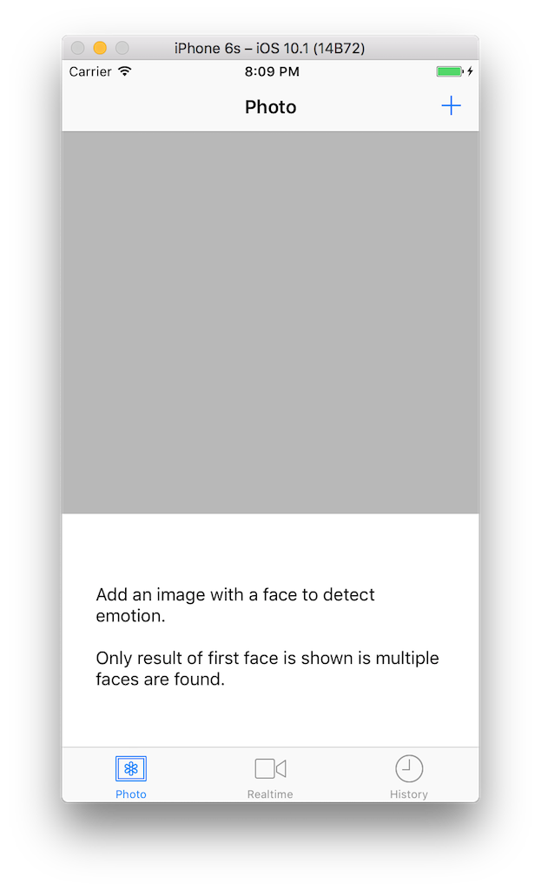
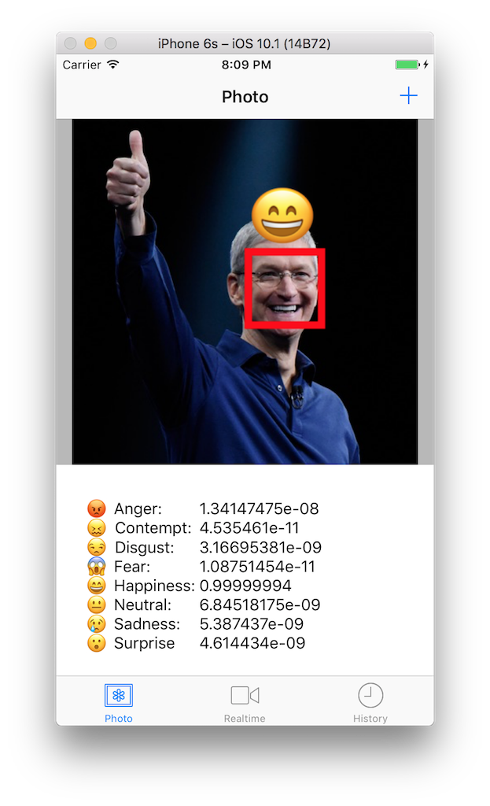

# Emotion
This is a demo project from Team cog.io of Microsoft Student Partners.

This project is a simple iOS application that utilizes Microsoft Cognitive Services Emotion API to show emotions of people from a photo or real time video of a camera.

## Screenshot

## Build Configuration

* Xcode 8.1
* Swift 3
* Cocoapods 1.1.1

## Build

* Download the project.
* Navigate to `Emotion` folder where `Podfile` exists.
* Open Terminal.app and run `pod install`.
* Open `Emotion.xcworkspace`.
* Select a target device. (iPhone simulator or an actual device) Notice that camera requires an acutal device to work.
* Run.

## Technology

* [Microsoft Cognitive Services](https://www.microsoft.com/cognitive-services)
* [Emotion API](https://www.microsoft.com/cognitive-services/en-us/emotion-api)
  * [Documentation](https://www.microsoft.com/cognitive-services/en-us/emotion-api/documentation)
  * [API Reference](https://dev.projectoxford.ai/docs/services/5639d931ca73072154c1ce89/operations/563b31ea778daf121cc3a5fa)

## License

MIT License

Copyright (c) 2016 BumMo Koo

Permission is hereby granted, free of charge, to any person obtaining a copy of this software and associated documentation files (the "Software"), to deal in the Software without restriction, including without limitation the rights to use, copy, modify, merge, publish, distribute, sublicense, and/or sell copies of the Software, and to permit persons to whom the Software is furnished to do so, subject to the following conditions:

The above copyright notice and this permission notice shall be included in all copies or substantial portions of the Software.

THE SOFTWARE IS PROVIDED "AS IS", WITHOUT WARRANTY OF ANY KIND, EXPRESS OR IMPLIED, INCLUDING BUT NOT LIMITED TO THE WARRANTIES OF MERCHANTABILITY, FITNESS FOR A PARTICULAR PURPOSE AND NONINFRINGEMENT. IN NO EVENT SHALL THE AUTHORS OR COPYRIGHT HOLDERS BE LIABLE FOR ANY CLAIM, DAMAGES OR OTHER LIABILITY, WHETHER IN AN ACTION OF CONTRACT, TORT OR OTHERWISE, ARISING FROM, OUT OF OR IN CONNECTION WITH THE SOFTWARE OR THE USE OR OTHER DEALINGS IN THE SOFTWARE.